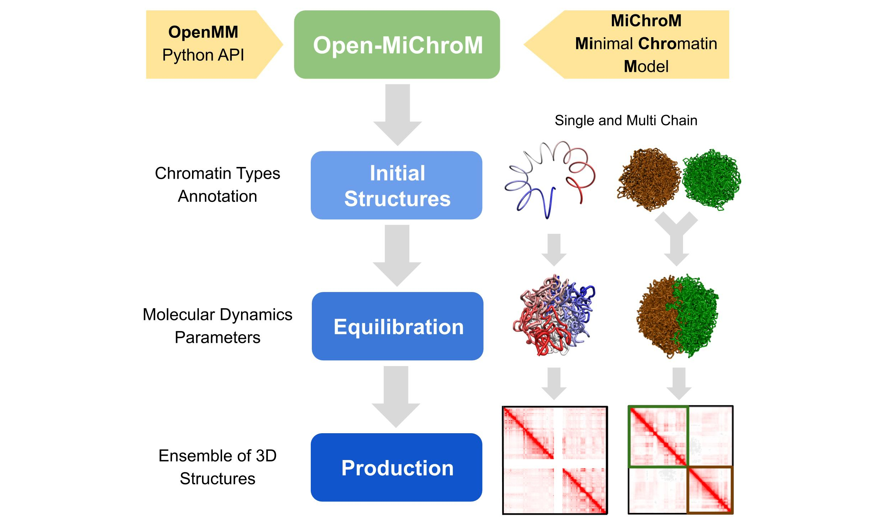
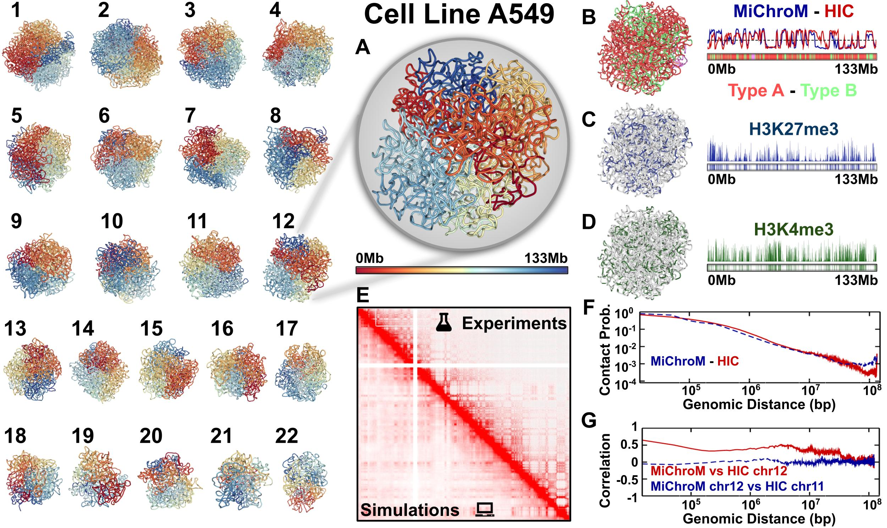

Open-MiChroM is a Python library for performing chromatin dynamics simulations :cite:p:`oliveira_junior_scalable_2021`. Open-MiChroM uses the  `OpenMM <http://openmm.org/>`_. Python API employing the MiChroM (Minimal Chromatin Model) energy function :cite:p:`di_pierro_transferable_2016`. The chromatin dynamics simulations generate an ensemble of 3D chromosomal structures that are consistent with experimental Hi-C maps :cite:p:`contessoto_nucleome_2021`. Open-MiChroM also allows simulations of a single or multiple chromosome chain using High-Performance Computing in different platforms (GPUs and CPUs).

The chromatin dynamics simulations can be performed for different human cell lines, cell phases (interphase to metaphase), and different organisms from  `DNAzoo <https://www.dnazoo.org/>`_. Chromatin subcompartment annotations are available at the  `NDB (Nucleome Data Bank) <https://ndb.rice.edu/>`_.
Open-MiChroM package receives the chromatin sequence of compartments and subcompartments as input to create and simulate a chromosome polymer model. Examples of running the simulations and generating the *in silico* Hi-C maps can be found `here <../Tutorials/single_chain.html>`_

.. bibliography:: docs/Reference/OpenMiChroM.bib
    :style: unsrt
