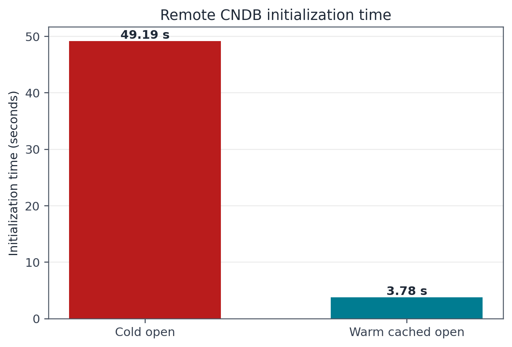
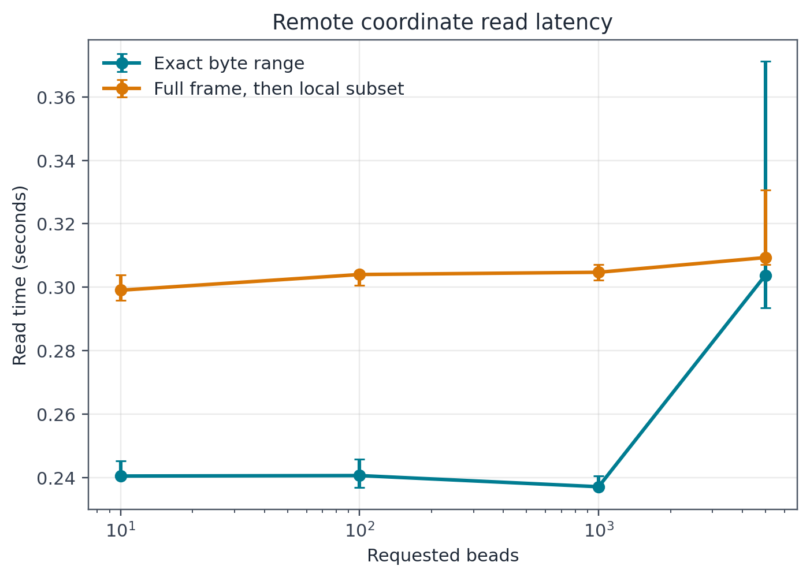
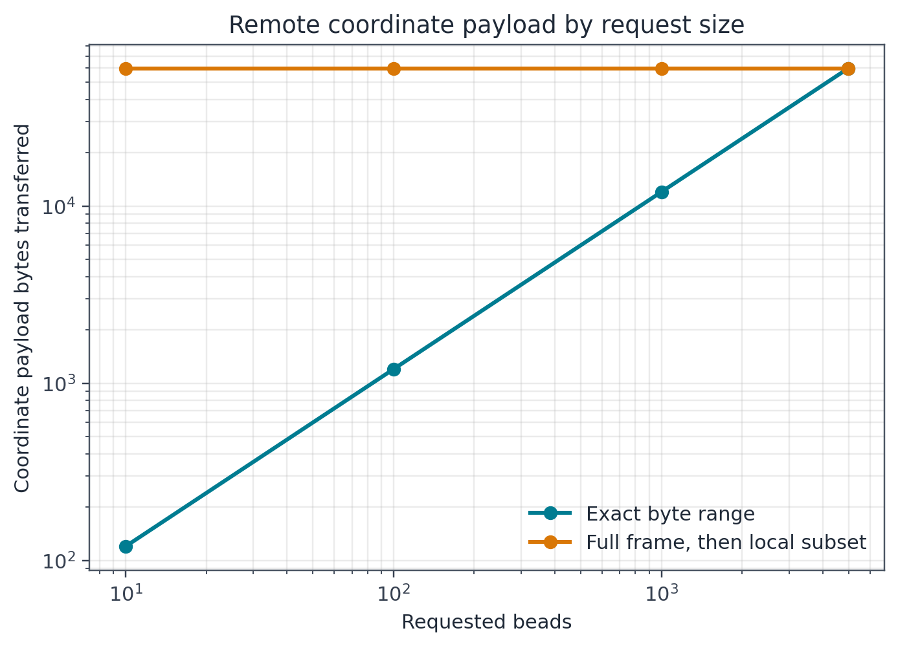
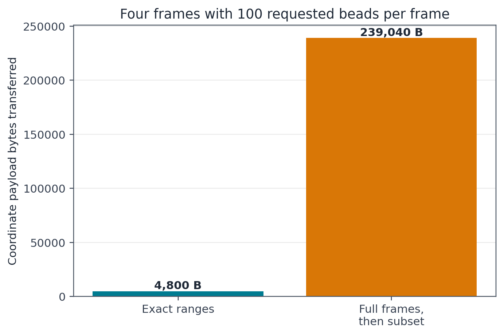

Remote CNDB streaming benchmark
===============================

This report records a real-network benchmark of the internal CNDBTools
streaming backend. It compares exact contiguous bead-range reads with the older
notebook-style pattern of reading a complete frame and then selecting beads in
NumPy.

The benchmark is reproducible with
``scripts/benchmark_remote_cndb.py``. Raw per-repeat measurements are stored in
``benchmarks/results/encode_remote_streaming_2026-07-27.csv`` and the structured
summary is stored in
``benchmarks/results/encode_remote_streaming_2026-07-27.json``.

Test configuration
------------------

The measurements were recorded on 27 July 2026 with Python 3.11.8 on Apple
Silicon macOS. Network conditions vary, so the timings should be interpreted as
observations rather than fixed performance guarantees.

Dataset
   The public 139,009,629,470-byte ENCODE CNDB file
   ``ENCFF161DID.cndb``.

URL
   https://encode-public.s3.amazonaws.com/2023/02/02/7f75d816-342a-4b49-adbd-aaa499dc5201/ENCFF161DID.cndb

Trajectory
   ``replica1_chr1``.

Frame size
   4,980 beads by 3 coordinates, stored as ``float32``. One complete frame
   therefore contains 59,760 coordinate bytes.

Read repetitions
   Three per operation. Tables report median wall time.

Metadata handling
   Frame metadata for frames 1, 10, 100, and 1000 was prefetched before timed
   coordinate reads. Prefetching took 0.861 seconds and transferred 24,576 HDF5
   metadata bytes but no coordinate bytes.

Safety
   CNDBTools required HTTP ``206 Partial Content`` for every HDF5 range request.
   The full CNDB file was not downloaded.

Initialization
--------------

.. list-table::
   :header-rows: 1
   :widths: 28 18 20 20 20

   * - Operation
     - Time (s)
     - Index bytes
     - Metadata bytes
     - Total bytes
   * - Cold open
     - 49.193
     - 25,518,894
     - 1,055,416
     - 26,574,310
   * - Warm cached open
     - 3.779
     - 0
     - 331,448
     - 331,448

The warm open was 13.0 times faster in this run. The local cache contained
25,306,806 bytes of compressed parsed index metadata; it did not contain
coordinate data.

Single-frame reads
------------------

.. list-table::
   :header-rows: 1
   :widths: 15 21 20 21 22

   * - Requested beads
     - Exact range time (s)
     - Exact data bytes
     - Full-frame time (s)
     - Full-frame data bytes
   * - 10
     - 0.2405
     - 120
     - 0.2990
     - 59,760
   * - 100
     - 0.2406
     - 1,200
     - 0.3040
     - 59,760
   * - 1,000
     - 0.2371
     - 12,000
     - 0.3047
     - 59,760
   * - 4,980 (full frame)
     - 0.3037
     - 59,760
     - 0.3093
     - 59,760

For the 10-, 100-, and 1,000-bead requests, exact reads were 19.6%, 20.9%, and
22.2% faster in this run. More importantly, they reduced coordinate transfer by
factors of 498, 49.8, and 4.98 respectively. Small reads have similar wall time
because request latency dominates their small payloads.

Multiple frames
---------------

Reading beads 0 through 99 from frames 1, 10, 100, and 1000 took a median of
0.937 seconds and transferred exactly 4,800 coordinate bytes. Reading four
complete frames and selecting the same beads locally took 1.217 seconds and
transferred 239,040 coordinate bytes. Exact ranges therefore reduced coordinate
transfer by 49.8 times and reduced median wall time by 23.0% in this run.

Interpretation
--------------

The benchmark supports three practical conclusions:

* The embedded index has a meaningful one-time startup cost. Supplying
  ``index_cache_path`` makes repeated sessions substantially faster and avoids
  another 25.5 MB remote index transfer.
* For one small frame, network latency limits wall-clock improvement because
  the complete frame is only about 60 KB. Exact reads still transfer much less
  data.
* The transfer advantage compounds across frames, trajectories, and analyses
  that use selected loci. This is the intended workload for the streaming
  backend.

The comparison uses the same CNDBTools HTTP and HDF5 metadata backend for both
methods. The only difference is whether the requested bead range or the full
frame coordinate payload is fetched before NumPy subsetting.

Reproduce the benchmark
-----------------------

From the repository root:

.. code-block:: bash

   python scripts/benchmark_remote_cndb.py \
       --refresh-cache \
       --repeat-reads 3

The embedded-index cache is written under ``/tmp`` by default. CSV and JSON
results are written under ``benchmarks/results``; PNG and SVG figures are
written under ``docs/source/_static/benchmarks``. The command requires internet
access but does not download the complete ENCODE CNDB file.
